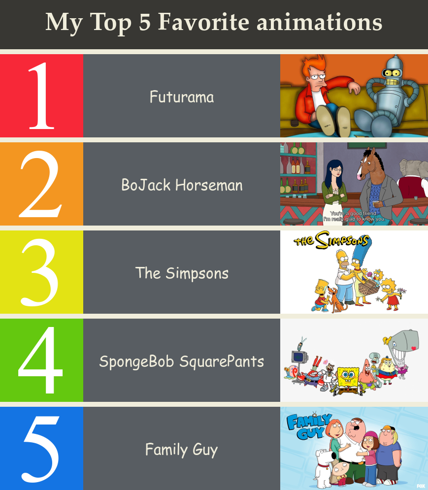

# **✨Hello World ! Hello Friends !✨**
#### Welcome to my Stats220 Website!🤗🤗🤗

## 👁️‍🗨️About me👁️‍🗨️

### 👩‍🎓 I am a sophomore majoring in statistics 📡.

### 📽️ At free time, I like to watch comedies, talk shows and animations, and read books. They make me happy. 😀


## 🖼️ My image 🎭

### Here is my image. Did you guess correctly? 🤔
### It is about `🎉ANIMATIONS🎉`. 



## 📜Information about the image 🔖

### R Package 📦

#### I made this image by using the R package [{magick}](https://cran.r-project.org/web/packages/magick/vignettes/intro.html)📦.

### R Code 💻
```
library(magick)

futurama <- image_read("https://www.teahub.io/photos/full/213-2139236_futurama-bender-y-fry.jpg") %>%
  image_scale(300)
spongebob <- image_read("https://png.pngitem.com/pimgs/s/152-1524349_spongebob-squarepants-characters-png-transparent-png.png") %>%
  image_scale(300)
simpsons <- image_read("https://images.pngnice.com/download/2007/The-Simpsons-PNG-Pic.png") %>%
  image_scale(300)
horseman <- image_read("https://i.kym-cdn.com/photos/images/facebook/001/742/038/b5e.png") %>%
  image_scale(300)
familyguy <- image_read("https://wallpaperaccess.com/full/1322957.jpg")  %>%
  image_scale(300)
  
num1_block <- image_blank(width = 169, height = 169, color = "#F72838") %>% 
  image_annotate(text = "1", color = "#FFFFFF", size = 200, font = "serif", gravity = "center")
num2_block <- image_blank(width = 169, height = 169, color = "#F39621") %>% 
  image_annotate(text = "2", color = "#FFFFFF", size = 200, font = "serif", gravity = "center")
num3_block <- image_blank(width = 169, height = 169, color = "#E3E314") %>% 
  image_annotate(text = "3", color = "#FFFFFF", size = 200, font = "serif", gravity = "center")
num4_block <- image_blank(width = 169, height = 169, color = "#64C80F") %>% 
  image_annotate(text = "4", color = "#FFFFFF", size = 200, font = "serif", gravity = "center")
num5_block <- image_blank(width = 169, height = 169, color = "#1474E3") %>% 
  image_annotate(text = "5", color = "#FFFFFF", size = 200, font = "serif", gravity = "center")
  
num1_content <- image_blank(width = 400, height = 169, color = "#585D62") %>% 
  image_annotate(text = "Futurama", color = "#F0EDDB", size = 30, font = "Comic Sans", gravity = "center")
num2_content <- image_blank(width = 400, height = 169, color = "#585D62") %>% 
  image_annotate(text = "BoJack Horseman", color = "#F0EDDB", size = 30, font = "Comic Sans", gravity = "center")
num3_content <- image_blank(width = 400, height = 169, color = "#585D62") %>% 
  image_annotate(text = "The Simpsons", color = "#F0EDDB", size = 30, font = "Comic Sans", gravity = "center")
num4_content <- image_blank(width = 400, height = 169, color = "#585D62") %>% 
  image_annotate(text = "SpongeBob SquarePants", color = "#F0EDDB", size = 30, font = "Comic Sans", gravity = "center")
num5_content <- image_blank(width = 400, height = 169, color = "#585D62") %>% 
  image_annotate(text = "Family Guy", color = "#F0EDDB", size = 30, font = "Comic Sans", gravity = "center")
  
title_block <- image_blank(width = 869, height = 100, color = "#383733") %>% 
  image_annotate(text = "My Top 5 Favorite animations", color = "#F0EDDB", size = 50, font = "Palatino", weight = 700, gravity = "center")
white_block <- image_blank(width = 869, height = 10, color = "#F0EDDB")

first_row <- c(num1_block, num1_content, futurama) %>% image_append()
second_row <- c(num2_block, num2_content, horseman) %>% image_append()
third_row <- c(num3_block, num3_content, simpsons) %>% image_append()
fourth_row <- c(num4_block, num4_content, spongebob) %>% image_append()
fifth_row <- c(num5_block, num5_content, familyguy) %>% image_append()

final_image <- c(title_block, white_block, first_row, white_block, 
                 second_row, white_block, third_row, white_block, 
                 fourth_row, white_block, fifth_row) %>% 
  image_append(stack = TRUE)
  
final_image
image_write(final_image, "my_meme.png")
```

### Inspirations and Motivations for the Image 👣👣👣👣

#### 1. The inspiration was from the topic "Top 40 songs" in the lecture🎶🎶🎶🎶.
#### 2. Recently, my younger sister started to study English, but she preferred to watch TV. 📙 or 📺?
#### 3. I came up with an idea to combine two things—watching English animations 💡.
#### 4. The inspiration for the appearance of my image was from a [picture online](https://sportsbrowser.net/wp-content/uploads/2021/10/most-popular-sports-in-america-infographics_5283a.png) 🖼️.
#### 5. I collected the animations pictures, arranged, coded and made this final image📝📝📝📝📝🖼️. 


